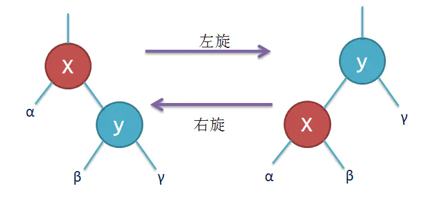

# 二叉树

<https://juejin.im/post/6844903582202855438#heading-3>

树：非线性数据结构,存储层级关系数据，有序列表。

由边连接的节点组成  

根节点: 一棵树最上面的节点称为根节点，

如果一个节点下面连接多个节点，那么该节点称为父节点，它下面的节点称为子节点。一个节点可以有0个、1个或多个子节点。

叶子节点：没有任何子节点的节点称为叶子节点。  

二叉树：二叉树是一种特殊的树，它的子节点个数不超过两个(左节点，右节点)。二叉树具有一些特殊的计算性质，使得在它们之上的一些操作异常高效。  

路径：从一个节点到另一个节点的这一组边称为路径。  

遍历：以某种特定顺序访问树中所有的节点称为树的遍历。  

深度：树可以分为几个层次，根节点是第0层，它的子节点是第1层，子节点的子节点是第2层，以此类推。树中任何一层的节点可以都看做是子树的根，该子树包含根节点的子节点，子节点的子节点等。我们定义树的层数就是树的深度。  

非空左子树的所有键值小于其根结点的键值

非空右子树的所有键值大于其根结点的键值

## 二叉查找树(BST)

<https://juejin.im/post/6844903974454165511>

二叉查找树是一种特殊的二叉树，相对较小的值保存在左节点中，较大的值保存在右节点中。

这一特性使得查找的效率很高，对于数值型和非数值型的数据，比如单词和字符串，都是如此。二叉查找树有较高的插入和删除效率，并且具备较高的查找效率，对组织动态数据比较友好。

查找所需的最大次数等同于二叉查找树的高度,也正是二分查找的思想

特点：

左子树上所有结点的值均小于或等于它的根结点的值。

右子树上所有结点的值均大于或等于它的根结点的值。

左、右子树也分别为二叉排序树。

没有键值相等的点

### 插入

从根节点开始，设置为比较节点，比较当前值与比较结点。 如果当前节点小，设置比较节点的左节点为新的比较节点 ，再进行比较当前值与比较结点。

也就是从根节点开始，当前值与根节点比较，小于根节点就与根结点的左节点比较，再小于根节点的左节点，就与根节点的左节点的左节点比较，依次类推。大于情况，取右节点类似。

```javascript
//节点
function Node( data, left, right) {
  this.data = data;
  this.left = left;
  this.right = right;
  this.show = show;
}
function show() {
  return this. data;
}
//二叉树
function BST() {
  //初始根节点为null
  this.root = null;
  this.insert = insert;
  this.inOrder = inOrder;
}
//插入节点
function insert( data) {
  var n = new Node( data, null, null);
  //如果是第一个节点
  if (this.root == null) {
    this.root = n;
  } else {
    //当前节点设置为根节点  
    var current = this.root;
    var parent;
    while (true) {
      parent = current;
      //如果插入值 < 当前节点
      if (data < current.data) {
        //当前节点设置为当前节点左节点
        current = current.left;
        //如果当前节点左节点为空 进行赋值操作
        if (current == null) {
          parent.left = n;
          break;
        }
        //左节点不为空 ,continue循环
      } else {
        //如果插入值 > 当前节点
        current = current.right;
        //如果当前节点右节点为空 进行赋值操作
        if (current == null) {
           parent.right = n;
           break;
        }
        //右节点不为空 ,continue循环
      }
    }
  }
}
//实践
var bst=new BST();
bst.insert(23);
bst.insert(45);
bst.insert(16);
bst.insert(37);
bst.insert(3);
bst.insert(99);
bst.insert(22);
bst.insert(24);
bst.insert(25);

//           23
//  16                45
//3   22           37   99
//              24
//                 25
```

### 遍历

前中后序命名是以遍历时根节点在 左右中 三个位置中优先遍历位置命名。

一句话总结：先序(根->左->右)，中序(左->根->右)，后序(左->右->根)。如果访问有孩子的节点，先处理孩子的，随后返回

前中后序的实际访问表现，会在访问时，如果子节点可以作为左中右的其中一个的起始规则，则会递归子节点进行访问规则。

- 中序：左中右。

中序遍历二叉查找树，得到的就是一个升序的数列

从最左侧叶子节点开始遍历，左中右 -》 以中的父为左 继续 左中右 。 优先遍历最深的左节点，同后序遍历类似，当 访问右节点时， 如果 右节点有左子节点，则优先访问该左子节点，而不是该 右节点。但是如果 右节点没有左子节点，只有右子节点，则优先访问该右节点

- 先序：中左右。

从根节点开始，-》 根的左节点 -》 根的左节点的左节点 -》 左节点都为null，末尾左节点的右节点。

访问左节点时，如果左节点有子节点，则把该左节点当作中节点，继续递归 访问中左右。

- 后序：左右中。

访问 右节点 时： 如果 右节点有左子节点，则优先访问该左子节点，而不是该 右节点。如果 右节点没有左子节点，只有右子节点，则优先访问该右子节点，而不是该 右节点

```javascript
//中序 输出:3 16 22 23 24 25 37 45 99
function inOrder( node) {
  if (!(node == null)) {
    inOrder( node.left);
    console.log( node.show() + " ");
    inOrder( node.right);
  }
}

//先序：输出:23 16 3 22 45 37 24 25 99
function preOrder( node) {
  if (!(node == null)) {
    console.log( node. show() + " ");
    preOrder( node. left);
    preOrder( node. right);
  }
}

//后序: 输出 3 22 16 25 24 37 99 45 23
function postOrder( node) {
  if (!(node == null)) {
    postOrder( node. left);
    postOrder( node. right);
    console.log( node. show() + " ");
  }
}
```

### 查找

查找给定值，最大值，最小值

从根结点开始，如果树为空，则返回NULL

如果树不为空，则根结点的值与查找值X进行比较，并进行不同的处理:

如果X等于根结点的值，则查找完成，返回结点

如果X小于根结点的值，则在左子树中继续查找

如果X大于根结点的值，则在右子树中继续查找

伪代码 逻辑：

```js
def find(root: TreeNode, key):
    if not root:
        return None
    if key == root.val:
        return root
    elif key < root.val:
        return find(root.left, key)
    else:
        return find(root.right, key)
```

将上面的递归优化为迭代:

```js
def find(root: TreeNode, key):
    if not root:
        return None
    while root:
        if key == root.val:
            return root
        elif key < root.val:
            root = root.left
        else:
            root = root.right
```

可以看的出来，算法的复杂度和树的高度有关，每一次对比之后都会舍弃掉原来数据的一半，因此算法的时间复杂为O(logn)

实现：

```javascript
//最小值:遍历左子树的最后一个节点
function getMin() {
  var current = this. root;
  while (!(current. left == null)) {
    current = current. left;
  }
  return current. data;
}
//最大值：遍历右子树的最后一个节点
function getMax() {
  var current = this. root;
  while (!(current. right == null)) {
    current = current. right;
  }
  return current. data;
}
//给定值
function find( data) {
  var current = this. root;
  while (current != null) {
    if (current. data == data) {
      return current;
    } else if (data < current. data) {
      current = current. left;
    } else {
      current = current. right;
    }
  }
  return null;
}
```

根据二叉查找树的性质:

最小元素一定是在树的最左分枝的端结点上

最大元素一定是在树的最右分枝的端结点上

### 删除

```javascript
function remove( data) {
  root = removeNode( this. root, data);
}
function removeNode( node, data) {
  if (node == null) {
    return null;
  }
  if (data == node. data) {
    //没有 子 节点 的 节点
    if (node. left == null && node. right == null) { return null; }
    //没有 左 子 节点 的 节点
    if (node. left == null) { return node. right; }
    //没有 右 子 节点 的 节点
    if (node. right == null) { return node. left; }
    //有两个子节点的节点
    //正确的做法有两种：要么查找待删除节点左子树上的最大值，要么查找其右子树上的最小值。这里我们选择后一种方式。
    var tempNode = getSmallest( node. right);
    node. data = tempNode. data;
    node. right = removeNode( node. right, tempNode. data);
    return node;
  } else if (data < node. data) {
    node. left = removeNode( node. left, data);
    return node;
  } else {
    node. right = removeNode( node. right, data);
    return node;
  }
}
```

### 节点计次

```javascript
function Node( data, left, right) {
  this. data = data;
  this. count = 1;
  this. left = left;
  this. right = right;
  this. show = show;
}
//计次函数
function update( data) {
  var grade = this. find( data);
  grade. count++;
  return grade;
}
```

## 红黑树

红黑树是一种自平衡的二叉查找树 RBTree

红黑树的应用非常广泛，常见的函数库，如C++中的map，multimap,以及Java中的TreeMap，TreeSet， Java8中的HashMap的实现也采用了红黑树。

它主要是为了解决不平衡的二叉查找树的查找效率不高的缺点。红黑树保证了从根到叶子 节点的最长路径不会超过最短路径的两倍。

特点：

1.节点是红色或黑色。

2.根节点是黑色。

3.每个叶子节点都是黑色的空节点（NIL节点）。

4 每个红色节点的两个子节点都是黑色。(从每个叶子到根的所有路径上不能有两个连续的红色节点)

5.从任一节点到其每个叶子的所有路径都包含相同数目的黑色节点。

### 变色

为了重新符合红黑树的规则，尝试把红色节点变为黑色，或者把黑色节点变为红色。

### 旋转



```
x{
  left: {
    value: a
  },
  right: {
    value: y,
    left: {
      value: b
    },
    right: {
      value: c
    }
  }
}

上面左旋后 为下面
下面右旋后 为上面

y{
  left: {
    value: x,
    left: {
      value: a
    },
    right: {
      value: b
    }
  },
  right: {
    value: c,
  }
}
```

#### 左旋

当在某个节点x上做左旋时，我们假设它的右孩子是y节点并且不为NIL。

左旋以x到y之间的轴为支撑，

左旋后，y成为该局部新的根，

x成为y的做孩子，

而y的左孩子成为x的右孩子

#### 右旋

与左旋类似，是左旋的反向操作

x, y 互换

### 插入

新插入的节点总是设为红色的, 只有在新插入节点的父节点为红色节点时需要做修复操作

直到当前节点转移到root节点，且root节点为黑色，修复操作结束。

3种情况：

#### 情况1 ：当前节点的父节点是红色，且祖父节点的另一个子节点（叔叔节点）也是红色

对策 : 把父节点和叔叔节点变黑，爷爷节点涂红，然后把当前节点指针给到爷爷，让爷爷节点那层继续循环，接受红黑树特性检测。

#### 情况2： 当前节点的父节点是红的，叔叔节点是黑的，当前节点是父节点的右子树

对策：当前节点的父节点作为新的当前节点，以新当前指点为支点左旋

#### 情况3：当前节点的父节点是红色，叔叔节点是黑色，且当前节点是其父节点的左儿子

对策： 父节点变黑，祖父变红，以祖父节点为支点右旋

### 删除

删除操作首先也需要做普通BST的删除操作，删除操作会删除对应的节点，叶子节点就会直接删除，如果是非叶子节点，就会用中序遍历的后继节点来顶替要删除的节点，有的书上也会用前驱节点来顶替。删除后也需要做修复操作，来满足红黑树的特性。

在删除一个节点后，如果删除的节点时红色节点，那么红黑树的性质并不会被影响，此时不需要修正，如果删除的是黑色节点，原红黑树的性质就会被改变，此时我们需要做修正。
