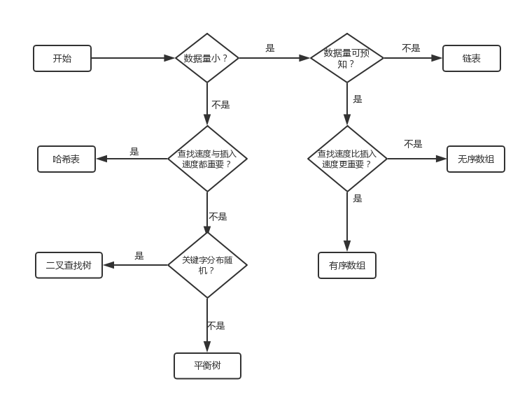

# 概念

<https://blog.csdn.net/alpharun/article/details/53890545>

<https://juejin.im/post/6844903646900011021>

## 网站

[代码随想录](https://programmercarl.com/0139.%E5%8D%95%E8%AF%8D%E6%8B%86%E5%88%86.html#%E7%AE%97%E6%B3%95%E5%85%AC%E5%BC%80%E8%AF%BE)

## 算法优化思路

利用已有计算结果，利用缓存， 占用少空间， 占用少时间

## 算法书籍

- 《算法导论》

练习题以及答案：<https://walkccc.github.io/CLRS/Chap07/7.1/>

- 《算法》
- 《编程珠玑》
- 《算法图解》
- 《数据结构与算法的JavaScript描述》

### 基本数学

- 《具体数学：计算机科学基础》
- 《程序员的数学》

高等数学??

图灵数学书籍：<https://www.ituring.com.cn/article/273677>

知识点:

- 数学符号

### 趣味数学

- 《神奇的数学》
- 《疯狂的罗素》
- 《漫画傅里叶解析》

## 数据结构与算法选择

