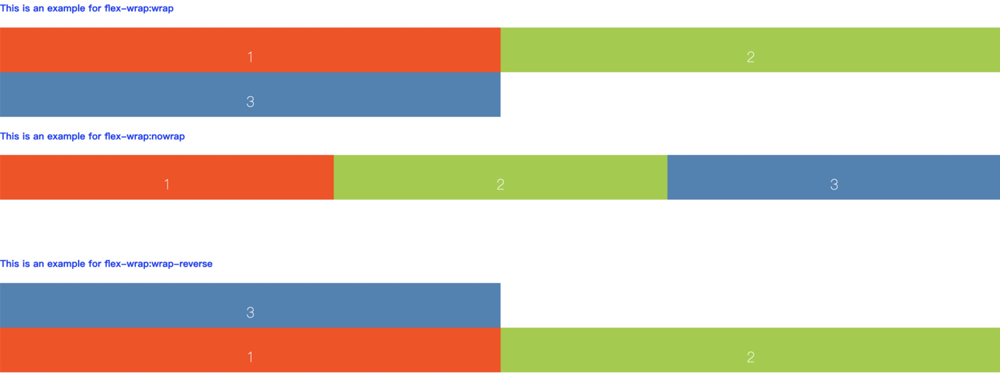

# css

目录

- [box-shadow](#box-shadow)
- [transition](#transition)
- [transform](#transform)
- [角度单位](#角度单位)
- [距离尺寸单位](#距离尺寸单位)
- [position](#position)
- [white-space](#white-space)
- [word-break](#word-break)
- [animation](#animation)
- [flex布局](#flex布局)
- [选择器](#选择器)
- [行内元素和块元素](#行内元素和块元素)
- [0.5px的边](#0.5px的边)
- [清除浮动](#清除浮动)
- [overflow](#overflow)
- [水平居中](#水平居中)
- [垂直居中](#垂直居中)
- [三栏布局](#三栏布局)
- [两列固定-一列自适应](#两列固定-一列自适应)
- [左边定宽-右边自适应](#左边定宽-右边自适应)
- [全页面布局](#全页面布局)
- [BFC](#BFC)
- [media媒体查询](#media)
- [initial等](#initial等)
- [background](#background)
- [文字溢出](#文字溢出)
- [等宽字体](#等宽字体)
- [垂直居中](#垂直居中)
- [margin](#margin)
- [vertical-align](#vertical-align)

布局相关:<https://segmentfault.com/a/1190000013565024?utm_source=channel-hottest#item-1>

***

## 角度单位

\<angle>

deg :度 360deg  
grad :百分度 400grad  
rad :弧度 2π  
turn :1turn  

## 距离尺寸单位

\<length>

形式：\<number> + 长度单位（px，em，pt，in，mm，...）  

**相对单位：**  

### em  

### rem

The font size of the root element

<https://juejin.im/entry/5833f572128fe1006ccda98b>
<!-- <https://juejin.im/post/5b90e07ce51d450e6a2dd140> -->

- 一般认为网页中的根节点是 html 元素，所以采用的方式也是通过设置 html 元素的 font-size 来做屏幕适配

- 实现方案:

1. 方案1

  ```css
  @media screen and (min-width: 320px) {html{font-size:50px;}}
  @media screen and (min-width: 360px) {html{font-size:56.25px;}}
  @media screen and (min-width: 375px) {html{font-size:58.59375px;}}
  @media screen and (min-width: 400px) {html{font-size:62.5px;}}
  @media screen and (min-width: 414px) {html{font-size:64.6875px;}}
  @media screen and (min-width: 440px) {html{font-size:68.75px;}}
  @media screen and (min-width: 480px) {html{font-size:75px;}}
  @media screen and (min-width: 520px) {html{font-size:81.25px;}}
  @media screen and (min-width: 560px) {html{font-size:87.5px;}}
  @media screen and (min-width: 600px) {html{font-size:93.75px;}}
  @media screen and (min-width: 640px) {html{font-size:100px;}}
  @media screen and (min-width: 680px) {html{font-size:106.25px;}}
  @media screen and (min-width: 720px) {html{font-size:112.5px;}}
  @media screen and (min-width: 760px) {html{font-size:118.75px;}}
  @media screen and (min-width: 800px) {html{font-size:125px;}}
  @media screen and (min-width: 960px) {html{font-size:150px;}}
  ```

2. 方案2

```css
@media screen and (min-width: 320px) {html{font-size:312.5%;}}
@media screen and (min-width: 360px) {html{font-size:351.5625%;}}
@media screen and (min-width: 375px) {html{font-size:366.211%;}}
@media screen and (min-width: 400px) {html{font-size:390.625%;}}
@media screen and (min-width: 414px) {html{font-size:404.2969%;}}
@media screen and (min-width: 440px) {html{font-size:429.6875%;}}
@media screen and (min-width: 480px) {html{font-size:468.75%;}}
@media screen and (min-width: 520px) {html{font-size:507.8125%;}}
@media screen and (min-width: 560px) {html{font-size:546.875%;}}
@media screen and (min-width: 600px) {html{font-size:585.9375%;}}
@media screen and (min-width: 640px) {html{font-size:625%;}}
@media screen and (min-width: 680px) {html{font-size:664.0625%;}}
@media screen and (min-width: 720px) {html{font-size:703.125%;}}
@media screen and (min-width: 760px) {html{font-size:742.1875%;}}
@media screen and (min-width: 800px) {html{font-size:781.25%;}}
@media screen and (min-width: 960px) {html{font-size:937.5%;}}
```

3. 方案3

```

计算fontSize:

其中100为 : 1rem对应视觉稿多少px。可以是任意值的系数比。下面计算用rem2px来表示这个系数.

实际场景： 设计稿总宽700px 中的 元素10px
相当于实际情况 总宽window.innerWidth 中的 元素多少px = (固定rem , css输入单位)

window.innerWidth / designWidth 是px比例.

输入的css单位：x * 1rem
x * fontSize px / 设计稿元素 px = window.innerWidth / 设计稿总宽度 px

当设计稿元素 = 100px时，应该是对应的应该输入1rem 也就是计算的 fontSize
也就是=》
window.innerWidth / designWidth * 100 = 1rem = fontSize值;

导出结果:

fontsize = 1rem  = window.innerWidth / designWidth * 100 'px'
=>
fontsize / 100 = window.innerWidth / designWidth

```

```js
var designWidth = 640, rem2px = 100;
document.documentElement.style.fontSize =
  ((window.innerWidth / designWidth) * rem2px) + 'px';
```

4. 方案4

```js
function adapt(designWidth, rem2px){
  var d = window.document.createElement('div');
  d.style.width = '1rem';
  d.style.display = "none";
  var head = window.document.getElementsByTagName('head')[0];
  head.appendChild(d);
  var defaultFontSize = parseFloat(window.getComputedStyle(d, null).getPropertyValue('width'));
  d.remove();
  document.documentElement.style.fontSize = window.innerWidth / designWidth * rem2px / defaultFontSize * 100 + '%';
  var st = document.createElement('style');
  var portrait = "@media screen and (min-width: "+window.innerWidth+"px) {html{font-size:"+ ((window.innerWidth/(designWidth/rem2px)/defaultFontSize)*100) +"%;}}";
  var landscape = "@media screen and (min-width: "+window.innerHeight+"px) {html{font-size:"+ ((window.innerHeight/(designWidth/rem2px)/defaultFontSize)*100) +"%;}}"
  st.innerHTML = portrait + landscape;
  head.appendChild(st);
  return defaultFontSize
};
var defaultFontSize = adapt(640, 100);
```

**绝对单位：**

### px:像素（点）  

### mm:毫米  

### cm:厘米  

### in:英寸

### pt:磅  

### pc:12 点活字

## position

CSS position属性用于指定一个元素在文档中的定位方式。top，right，bottom 和 left 属性则决定了该元素的最终位置。

```
absolute
生成绝对定位的元素，相对于值不为static的第一个父元素的paddingbox进行定位，也可以理解为离自己这一级元素最近的
一级position设置为absolute或者relative的父元素的paddingbox的左上角为原点的。

fixed（老IE不支持）
生成绝对定位的元素，相对于浏览器窗口进行定位。

relative
生成相对定位的元素，相对于其元素本身所在正常位置进行定位。

static
默认值。没有定位，元素出现在正常的流中（忽略top,bottom,left,right,z-index声明）。

inherit
规定从父元素继承position属性的值。
```

## white-space

white-space CSS 属性是用来设置如何处理元素中的 空白。

```css
/* Keyword values */
white-space: normal;

white-space: nowrap;
/*和 normal 一样，连续的空白符会被合并。但文本内的换行无效。*/

white-space: pre;
white-space: pre-wrap;
white-space: pre-line;
```

## word-break

## transition

- transition:

property duration timing-function delay;  

transition:width 2s;  

- transition-property:

规定设置过渡效果的 CSS 属性的名称。

- transition-duration

规定完成过渡效果需要多少秒或毫秒:5s

- transition-timing-function

规定速度效果的速度曲线:

linear:规定以相同速度开始至结束的过渡效果（等于 cubic-bezier(0,0,1,1)）。

ease:规定慢速开始，然后变快，然后慢速结束的过渡效果（cubic-bezier(0.25,0.1,0.25,1)）。

ease-in :规定以慢速开始的过渡效果（等于 cubic-bezier(0.42,0,1,1)）。

ease-out :规定以慢速结束的过渡效果（等于 cubic-bezier(0,0,0.58,1)）。

ease-in-out :规定以慢速开始和结束的过渡效果（等于 cubic-bezier(0.42,0,0.58,1)）。

- transition-delay 定义过渡效果何时开始。  

## animation

## transform

只对 block 级元素生效！
不占用文档流

```css
/*****************matrix(矩阵)
https://www.cnblogs.com/Ivy-s/p/6786622.html
*/
/*
原始值：transform: matrix(a,b,c,d,e,f);
移动后：x'=ax+cy+e ， y'=bx+dy+f
*/
transform: matrix(1,0,0,1,0,0);
/*
平移 ：x y 分别平移10 （x'=ax+cy+e+10) （y'=bx+dy+f+10）
*/
transform: matrix(1,0,0,1,10,10);
/*
缩放 ：x y 分别缩放2（x'=2ax+cy+e) (y'=bx+2dy+f)
*/
transform: matrix(2,0,0,2,0,0);
/*
旋转 ：transform：matrix（cosθ，-sinθ,sinθ,cosθ,0,0);
45度
*/
transform: matrix(0.707,0.707,-0.707,0.707,0,0);

/*****************rotate(旋转)
参数:<angle>
*/
transform:  rotate(<angle>);
/*****************scale(缩放)
参数:<number>
*/  
transform:  scale(numberx[, numbery]);  
transform:  scaleX(numberx);
transform:  scaleY(numbery);
/*****************skew(倾斜)
参数:<angle>
*/  
transform:  skew(anglex[, angley]);
transform:  skewX(angle);
transform:  skewY(angle);
/*****************translate(平移)
参数:<length> <percentage>
*/
transform:  translate(tx[, ty])
transform:  translateX(tx)
transform:  translateY(ty)
```

## box-shadow

box-shadow: h-shadow v-shadow blur spread color inset;
h-shadow 必需。水平阴影的位置。允许负值。  
v-shadow 必需。垂直阴影的位置。允许负值。  
blur 可选。模糊距离。  
spread 可选。阴影的尺寸。  
color 可选。阴影的颜色。请参阅 CSS 颜色值。  
inset 可选。将外部阴影 (outset) 改为内部阴影。  

## flex布局

主轴:flex-direction:row | row-reverse | column | column-reverse  

交叉轴:垂直于主轴  

flex容器:display:flex;  

### 盒子属性

- flex-direction: row;更改 flex 元素的排列方向;  

- flex-wrap:[wrap | nowrap] 换行策略，是否自动换行，是否超出缩放，溢出;

```html
<h4>This is an example for flex-wrap:wrap </h4>
<div class="content">
  <div class="red">1</div>
  <div class="green">2</div>
  <div class="blue">v3</div>
</div>
<h4>This is an example for flex-wrap:nowrap </h4>
<div class="content1">
  <div class="red">1</div>
  <div class="green">2</div>
  <div class="blue">3</div>
</div>
<h4>This is an example for flex-wrap:wrap-reverse </h4>
<div class="content2">
  <div class="red">1</div>
  <div class="green">2</div>
  <div class="blue">3</div>
</div>
```

```css
/* Common Styles */
.content,
.content1,
.content2 {
  color: #fff;
  font: 100 24px/100px sans-serif;
  height: 150px;
  text-align: center;
}
.content div,
.content1 div,
.content2 div {
  height: 50%;
  width: 50%;
}
.red {
  background: orangered;
}
.green {
  background: yellowgreen;
}
.blue {
  background: steelblue;
}
/* Flexbox Styles */
.content {
  display: flex;
  flex-wrap: wrap;
}
.content1 {
  display: flex;
  flex-wrap: nowrap;
}
.content2 {
  display: flex;
  flex-wrap: wrap-reverse;
}
```



- flex-flow :flex-direction flex-wrap; 简写;  

- align-content: ;定义了多根轴线的对齐方式。如果项目只有一根轴线，该属性不起作用。  

- justify-content:[flex-start | flex-end | center | space-between | space-around | initial]  ;主轴上，元素之间及其周围的空间.元素如何排列，以及空间隔  

- align-items: flex-start | flex-end | center | baseline | stretch; 定义项目在交叉轴上如何对齐。  

### 子元素属性: flex item  

<https://developer.mozilla.org/zh-CN/docs/Web/CSS/flex>

- order:

[number] 定义项目的排列顺序。数值越小，排列越靠前，默认为0。

- flex:

flex-grow flex-shrink flex-basis;简写;规定了弹性元素如何伸长或缩短以适应flex容器中的可用空间

- flex-basis:  

布局空白的基准值  指定了 flex 元素在主轴方向上的初始大小

- flex-grow:

[number] ;定义项目的放大比例，默认为0，即如果存在剩余空间，也不放大。

- flex-shrink:

[number] ;flex 元素的收缩规则,flex 元素仅在默认宽度之和大于容器的时候才会发生收缩，其收缩的大小是依据 flex-shrink 的值;

### flex子元素不超出容器做法

```css
/* 子元素 */
flex:auto;
overflow:hidden;

/* 或者 */
flex:auto;
width:0;
```

## 选择器

```
（1）id选择器（#myid）
（2）类选择器（.myclassname）
（3）标签选择器（div,h1,p）
（4）后代选择器（h1p）
（5）相邻后代选择器（子）选择器（ul>li）
（6）兄弟选择器（li~a）
（7）相邻兄弟选择器（li+a）
（8）属性选择器（a[rel="external"]）
（9）伪类选择器（a:hover,li:nth-child）
（10）伪元素选择器（::before、::after）
（11）通配符选择器（*）
```  

**优先级：**
!important > 行内样式 > ID选择器 > 类选择器 > 标签 > 通配符 > 继承 > 浏览器默认属性

后写的会覆盖先写的

```
判断优先级时，首先我们会判断一条属性声明是否有权重，也就是是否在声明后面加上了!important。一条声明如果加上了权重，
那么它的优先级就是最高的，前提是它之后不再出现相同权重的声明。如果权重相同，我们则需要去比较匹配规则的特殊性。

一条匹配规则一般由多个选择器组成，一条规则的特殊性由组成它的选择器的特殊性累加而成。选择器的特殊性可以分为四个等级，
第一个等级是行内样式，为1000，第二个等级是id选择器，为0100，第三个等级是类选择器、伪类选择器和属性选择器，为0010，
第四个等级是元素选择器和伪元素选择器，为0001。规则中每出现一个选择器，就将它的特殊性进行叠加，这个叠加只限于对应的等
级的叠加，不会产生进位。选择器特殊性值的比较是从左向右排序的，也就是说以1开头的特殊性值比所有以0开头的特殊性值要大。
比如说特殊性值为1000的的规则优先级就要比特殊性值为0999的规则高。如果两个规则的特殊性值相等的时候，那么就会根据它们引
入的顺序，后出现的规则的优先级最高。
```

## 行内元素和块元素

块级元素： div p forn ul li h1-h6  
行内元素：span img input a i

## 0.5px的边

```css
.thinner-border {
  width: 10px;
  height: 20px;
  background: gray;
  position: relative; /* 只要不是默认值static即可 */
}
.thinner-border:before {
  content: '';
  position: absolute;
  border: 1px solid red;
  width: 200%;
  height: 200%;
  transform-origin: 0 0;
  transform: scale(0.5, 0.5);
  box-sizing: border-box;
}
```

## 清除浮动

1.给父级元素定义高度  
2.让父级元素也浮动  
3.父级定义display:table  
4.父元素设置overflow:hidden  
5.clearfix:使用内容生成的方式清除浮动  

```css
.clearfix:after {  /* :after选择器向选定的元素之后插入内容  */
  content:""; /* 生成内容为空  */
  display: block; /* 块级元素显示  */
  clear:both; /* 清除前面元素  */
}
```

## overflow

<https://juejin.im/post/581dcefbda2f60005df93b54>

> overflow 属性指定了一个块容器元素在其内容溢出这个元素的时候，内容是否裁掉。

**作用**

- overflow 的值为非 visible 的时候可以生成新的 BFC （块级格式化上下文），常见的结果就是：消除浮动影响（清除子元素浮动引起的父元素对自元素忽略空间效果）、左侧固定右侧自适应（不需要指定 margin-left ）、margin 不再折叠等。

- overflow:hidden 搭配 white-space:nowrap、text-overflow:ellipsis实现...效果。

- overflow:hidden 可以让 1px（ scale(0.5) 这种）显示的更加精细。

- overflow:hidden 可以解决移动端页面内容（一般文字内容相对多一点的时候效果更明显）会出现“进来左右方向缩小到一块”然后再变为正常布局的 bug ，这个 bug 会引起很明显的闪动效果。

> float浮动的div会失去独霸一行的能力，也就是宽度自填充满。而overflow清除子元素对父元素的浮动影响后，父元素可以独霸一行。

## 水平居中

**inline-block text-align**

**absolute transform**

```css
.parent {
    position:relative;
}
.child {
    position:absolute;
    left:50%;
    transform:translateX(-50%);
}
```

**flex justify-content**

## 垂直居中

**table-cell vertical-align**

```css
.parent {
  display:table-cell;
  vertical-align:middle;
}
```

**flex align-items**

**absolute transform**

```css
.wrap{
  position:relative;
  background:gray;
  height: 100px;
}
.test{
  background: red;
  width: 100px;
  position: absolute;
  top: 50%;
  left: 50%;
  transform: translate(-50%,-50%);
}
```

不破坏文档流，没有副作用

## 三栏布局

两边两栏宽度固定，中间栏宽度自适应

* position（绝对定位法） center的div需要放在最后面
  绝对定位法原理将左右两边使用absolute定位，因为绝对定位使其脱离文档流，后面的center会自然流动到他们的上卖弄，然后margin属性，留出左右两边的宽度。就可以自适应了。  
  
* float 自身浮动法 center的div需要放到后面
  自身浮动法的原理就是对左右使用float:left和float：right，float使左右两个元素脱离文档流，中间的正常文档流中，使用margin指定左右外边距对其进行一个定位。  

```html
<!DOCTYPE html>
<html>
<head lang="en">
    <meta charset="UTF-8">
    <title>双飞翼</title>
    <style>
.main{
    float:left;
    width:100%;
    height:100px;
    background:#999;
}
.left{
    float:left;
    width:180px;
    height:100px;
    margin-left:-100%;
    background:#111;
}
.right{
    float:left;
    width:200px;
    height:100px;
    margin-left:-200px;
    background:#eee;
}
.inline{
  /*main实际展示区域*/
  margin:0 200px 0 180px;
  background: #ddd;
}
</style>
</head>
<body>
  <div class="main">
    <div class="inline">middle</div>
  </div>
  <div class="left">left</div>
  <div class="right">right</div>
</body>
</html>
```

* 圣杯布局：

```html
<!DOCTYPE html>
<html>
<head lang="en">
<title>圣杯</title>
<style>
.container{
  /*控制main区域*/
  padding:0 200px 0 180px;
  height:100px;
}
.main{
  /*继承container宽度*/
  float:left;
  width:100%;
  height:100px;
  background:#999;
}
.left{

  float:left;
  width:180px;
  height:100px;
  /*左移到左侧 相对main区域*/
  position:relative;
  left:-180px;
  /*同位上移*/
  margin-left:-100%;
  background:#111;
}
.right{
  float:left;
  width:200px;
  height:100px;
  margin-left:-200px;
  background:#eee;
  position:relative;
  right:-200px;
}
</style>
</head>
<body>
<div class="container">
  <div class="main">middle</div>
  <div class="left">left</div>
  <div class="right">right</div>
</div>
</body>
</html>
```

## 两列固定-一列自适应

```html
<div class="left">
  <p>left</p>
</div>
<div class="center">
  <p>center</p>
</div>
<div class="right">
  <p>right</p>
  <p>right</p>
</div>
```

> overflow: hidden 可以抵消受到同层级float元素的效果,并且自适应宽度

```css
.left,.center{
    float: left;
    margin-right: 20px;
    outline: 1px solid red;
}
.right{
  overflow: hidden;
}
.left p,.center p{
    width: 100px;
}
```

## 左边定宽-右边自适应

**float cacl**

```css
.left{
  float:left;
  width: 200px;
  outline: 1px solid red;
}
.right{
  width:calc(100% - 200px);
  float:left;
  outline: 1px solid red;
}
```

**table table-cell**

```css
.container {
  display: table;
  table-layout: fixed;
  width: 100%;
}
.left, .right {
  display: table-cell;
  height: 600px;
}
.left {
  width: 400px;
  background-color: aqua;
}
.right {
  background-color: blueviolet;
}
```

**flex**

```css
.contain {
  display: flex
}
.right {
  flex: 1
}
```

**float margin**

```css
.left {
  width: 400px;
  float: left;
  border: 1px solid blue;
}
.right {
  margin-left: 400px;
  border: 1px solid red;
}
```

> div块元素，自适应宽度

```css
/* 改进 */
.left {
  float:left;
  width:100px;
  position:relative;
}
.right-fix {
  float:right;
  width:100%;
  margin-left:-100px;
  outline: 1px solid red;
}
.right {
  margin-left:120px;
}

```

**float overflow**

```css
.left {
  width: 400px;
  float: left;
  border: 1px solid blue;
}
.right {
  overflow: hidden;
  border: 1px solid red;
}
```

## 全页面布局

**absolute**

```html
<div class="parent">
  <div class="top">
    top
  </div>
  <div class="left">
    left
  </div>
  <div class="right">
    <div class="inner">
      right
    </div>
  </div>
  <div class="bottom">
    bottom
  </div>
</div>
```

```css
html,body,.parent{
    margin:0;
    height:100%;
    overflow:hidden;
}
body{
    color:white;
}
.top{
    position:absolute;
    top:0;
    left:0;
    right:0;
    height:100px;
    background:blue;
}
.left{
    position:absolute;
    left:0;
    top:100px;
    bottom:50px;
    width:200px;
    background:red;
}
.right{
    position:absolute;
    left:200px;
    top:100px;
    bottom:50px;
    right:0;
    background:pink;
    overflow: auto;
}
.right .inner{
    min-height: 1000px;
}
.bottom{
    position:absolute;
    left:0;
    right:0;
    bottom:0;
    height:50px;
    background: black;
}
```

> absolute时，设置top,bottom后，可以实现高度自适应

## BFC

(Block Formatting Context)

**定义：**

块级格式化上下文，它是指一个独立的块级渲染区域，只有Block-level Box参与，该区域拥有一套渲染规则来约束块级盒子的布局，且与区域外部无关。  

**生成：**  

满足下列CSS声明之一的元素便会生成BFC：  

根元素或其它包含它的元素；  
float的值不为none；  
overflow的值不为visible;  
position的值不为static；  
display的值为inline-block、table-cell、table-caption；  
flex boxes (元素的display: flex或inline-flex)；  

**用法：**

* 给父元素设置overflow:hidden可以清除子元素的浮动

```html
<div class="one">
  <div class="two">Hello World!</div>
</div>
你好世界！
```

```css
.one {
  background-color: pink;
  overflow: hidden;
}
.two {
  float: left;
}
```

* 解决margin重叠问题

```html
<div class="container">
  <div class="wrapper">
      <div class="box1"></div>
  </div>
  <div class="box2"></div>
</div>
```

```css
.container {
    overflow: hidden;
    width: 100px;
    height: 100px;
    background-color: red;
}
.wrapper {
    overflow: hidden;
}
.box1 {
    height: 20px;
    margin: 10px 0;
    background-color: green;
}
.box2 {
    height: 20px;
    margin: 20px 0;
    background-color: green;
}
```

* 解决侵占浮动元素的问题

```html
<div class="box1">box1</div>
<div class="box2">box2</div>
```

```css
.box1 {
  float: left;
  width: 100px;
  height: 100px;
  background-color: pink;
}
.box2 {
  width: 200px;
  height: 200px;
  background-color: skyblue;
  overflow: hidden;
  /*或者 float: left;*/
}
```

## media

```css
/* 321px 到 375px之间时的样式 */
@media screen and (min-width:321px) and (max-width:375px){
  html{
    font-size:11px
  }
}

```

### print

```css
@media print{
  /* background 无效时，添加 -webkit-print-color-adjust: exact; */
}

```

position,float 会导致打印位置错乱.

## initial等

initial,inherit,unset

initial 关键字可用于任何 HTML 元素上的任何 CSS 属性。

## background

- background:

url('../../static/images/home_logo.png') no-repeat center left / auto 80% ;

- background-size:

percentage|cover|contain|length

## 文字溢出

省略号

```html
<p></p>
```

```css
p{
  width:100px;
  text-overflow:ellipsis;
  overflow:hidden;
  word-break:keep-all;
}
```

## 等宽字体

比例字体

<https://cloud.tencent.com/developer/article/1009289>

## 垂直居中

1. 使用绝对定位和负外边距对块级元素进行垂直居中 （margin: -50px 0 0 0;）

必须提前知道被居中块级元素的尺寸

```css
#box {
    width: 300px;
    height: 300px;
    background: #ddd;
    position: relative;
}
#child {
    width: 150px;
    height: 100px;
    background: orange;
    position: absolute;
    top: 50%;
    margin: -50px 0 0 0;
    line-height: 100px;
}
```

2. 使用绝对定位和transform，（transform: translate(0, -50%)）

不必提前知道被居中元素的尺寸

```css
#box {
    width: 300px;
    height: 300px;
    background: #ddd;
    position: relative;
}
#child {
    background: #93BC49;
    position: absolute;
    top: 50%;
    transform: translate(0, -50%);
}
```

3. 使用绝对定位和负外边距

```css
#box {
    width: 300px;
    height: 300px;
    background: #ddd;
    position: relative;
}
#child {
　　width: 50%;
    height: 30%;
    background: pink;
    position: absolute;
    top: 50%;
    margin: -15% 0 0 0;
}
```

4. 绝对定位结合margin: auto，top和bottom设为相等的值

把要垂直居中的元素相对于父元素绝对定位，top和bottom设为相等的值，我这里设成了0，当然你也可以设为99999px或者-99999px无论什么，只要两者相等就行，这一步做完之后再将要居中元素的margin设为auto，这样便可以实现垂直居中了。

被居中元素的宽高也可以不设置，但不设置的话就必须是图片这种自身就包含尺寸的元素，否则无法实现。

```css
#box {
    width: 300px;
    height: 300px;
    background: #ddd;
    position: relative;
}
#child {
    width: 200px;
    height: 100px;
    background: #A1CCFE;
    position: absolute;
    top: 0;
    bottom: 0;
    margin: auto;
    line-height: 100px;
}
```

5. 使用padding

```css
#box {
  width: 300px;
  background: #ddd;
  padding: 100px 0;
}
#child {
  width: 200px;
  height: 100px;
  background: #F7A750;
  line-height: 50px;
}
```

7. flex

```css
#box {
  width: 300px;
  height: 300px;
  background: #ddd;
  display: flex;
  align-items: center;
}
```

10. line-height = height 和 vertical-align

```css
#box{
  width: 300px;
  height: 300px;
  background: #ddd;
  line-height: 300px;
}
#box img {
  vertical-align: middle;
}
```

11. display: table-cell 和 vertical-align

```css
#box {
  width: 300px;
  height: 300px;
  background: #ddd;
  display: table;
}
#child {
  display: table-cell;
  vertical-align: middle;
}

```

## margin

**属性：**

auto : 浏览器计算外边距

length : 规定以具体单位计的外边距值，比如像素、厘米等。默认值是 0px

% : 规定基于父元素的宽度的百分比的外边距

inherit : 规定应该从父元素继承外边距

**margin cllapse ，magin坍塌**

- 相邻：相邻元素margin会重叠，取最大值  

- 父子：子元素margin，会给父元素添加margin

父子元素解决办法：

1. 边框，当然可以设置边框为透明;

2. 为父DIV添加 padding，或者至少添加padding-top;

3. overflow:hidden

解决效果：子元素的margin在父空间内撑开。不会影响父元素。

## vertical-align

<https://segmentfault.com/a/1190000015366749>

指定行内元素（inline）或表格单元格（table-cell）元素的垂直对齐方式

对于块级元素，vertical-align是不起作用的

## cssreset和normalize.css

css reset 是最早的一种解决浏览器间样式不兼容问题的方案，它的基本思想是将浏览器的所有样式都重置掉，从而达到所有浏览器样式保持一致的效果。但是使用这种方法，可能会带来一些性能上的问题，并且对于一些元素的不必要的样式的重置，其实反而会造成画蛇添足的效果。

后面出现一种更好的解决浏览器间样式不兼容的方法，就是 normalize.css ，它的思想是尽量的保留浏览器自带的样式，通过在原有的样式的基础上进行调整，来保持各个浏览器间的样式表现一致。相对与 css reset，normalize.css 的方法保留了有价值的默认值，并且修复了一些浏览器的 bug，而且使用 normalize.css 不会造成元素复杂的继承链。

## 浏览器css前缀

```
mozilla 内核 （firefox,flock 等）    -moz
webkit  内核 （safari,chrome 等）   -webkit
opera   内核 （opera 浏览器）        -o
trident 内核 （ie 浏览器）           -ms
```

## 属性继承

```
每一个属性在定义中都给出了这个属性是否具有继承性，一个具有继承性的属性会在没有指定值的时候，会使用父元素的同属性的值
来作为自己的值。

一般具有继承性的属性有，字体相关的属性，font-size和font-weight等。文本相关的属性，color和text-align等。
表格的一些布局属性、列表属性如list-style等。还有光标属性cursor、元素可见性visibility。

当一个属性不是继承属性的时候，我们也可以通过将它的值设置为inherit来使它从父元素那获取同名的属性值来继承。
```

## css实现三角形

```
采用的是相邻边框连接处的均分原理。
将元素的宽高设为0，只设置border
把任意三条边隐藏掉（颜色设为transparent），剩下的就是一个三角形。
```

```css
#demo {
  width: 0;
  height: 0;
  border-width: 20px;
  border-style: solid;
  border-color: transparenttransparentredtransparent;
}
```

## 多列等高布局

```
（1）利用padding-bottom|margin-bottom正负值相抵，不会影响页面布局的特点。设置父容器设置超出隐藏（overflow:
hidden），这样父容器的高度就还是它里面的列没有设定padding-bottom时的高度，当它里面的任一列高度增加了，则
父容器的高度被撑到里面最高那列的高度，其他比这列矮的列会用它们的padding-bottom补偿这部分高度差。

（2）利用table-cell所有单元格高度都相等的特性，来实现多列等高。

（3）利用flex布局中项目align-items属性默认为stretch，如果项目未设置高度或设为auto，将占满整个容器的高度
的特性，来实现多列等高。
```

## 初始化css

```css
/* 淘宝的样式初始化代码： */
body,h1,h2,h3,h4,h5,h6,hr,p,blockquote,dl,dt,dd,ul,ol,li,pre,form,fieldset,legend
,button,input,textarea,th,td{margin:0;padding:0;}
body,button,input,select,textarea{font:12px/1.5tahoma,arial,\5b8b\4f53;}
h1,h2,h3,h4,h5,h6{font-size:100%;}
address,cite,dfn,em,var{font-style:normal;}
code,kbd,pre,samp{font-family:couriernew,courier,monospace;}
small{font-size:12px;}
ul,ol{list-style:none;}
a{text-decoration:none;}
a:hover{text-decoration:underline;}
sup{vertical-align:text-top;}
sub{vertical-align:text-bottom;}
legend{color:#000;}
fieldset,img{border:0;}
button,input,select,textarea{font-size:100%;}
table{border-collapse:collapse;border-spacing:0;}
```
