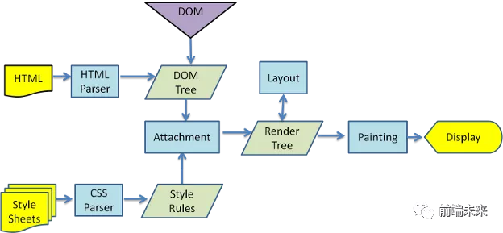

# 浏览器

## devtools

Performance

<https://www.jianshu.com/p/d8795ff8e079>

### pending

### chrome性能工具

<https://developers.google.com/web/tools/chrome-devtools/evaluate-performance/>

## 从输入URL后前端的知识

<https://mp.weixin.qq.com/s?__biz=MzUyMTMxMTc1Ng==&mid=2247483712&idx=1&sn=545325dc5a3e84be44554809264ba39b&chksm=f9dc4223ceabcb3566be4689fb49d9868712e572eb2a6bb08cb159dc4c4f0d55b22e0b667c92&scene=21#wechat_redirect>



## link和script顺序

<https://juejin.im/post/59c60691518825396f4f71a1>

**CSS 不会阻塞 DOM 的解析**

这里简单说一下，浏览器是解析DOM生成DOM Tree，结合CSS生成的CSS Tree，最终组成render tree，再渲染页面。由此可见，在此过程中CSS完全无法影响DOM Tree，因而无需阻塞DOM解析。然而，DOM Tree和CSS Tree会组合成render tree，那CSS会不会页面阻塞渲染呢？

**结论**

- CSS 不会阻塞 DOM 的解析，但会阻塞 DOM 渲染。
- JS 阻塞 DOM 解析，但浏览器会"偷看"DOM，预先下载相关资源。
- 浏览器遇到 \<script>且没有defer或async属性的 标签时，会触发页面渲染，因而如果前面CSS资源尚未加载完毕时，浏览器会等待它加载完毕在执行脚本。

**加载**

<https://zhuanlan.zhihu.com/p/29418126>

**defer与async**

defer 与相比普通 script，有两点区别：载入 JavaScript 文件时不阻塞 HTML 的解析，执行阶段被放到 HTML 标签解析完成之后。

async 属性表示异步执行引入的 JavaScript，与 defer 的区别在于，如果已经加载好，就会开始执行——无论此刻是 HTML 解析阶段还是 DOMContentLoaded 触发之后。需要注意的是，这种方式加载的 JavaScript 依然会阻塞 load 事件。换句话说，async-script 可能在 DOMContentLoaded 触发之前或之后执行，但一定在 load 触发之前执行。

## 缓存

<https://www.jianshu.com/p/54cc04190252>

通常浏览器缓存策略分为两种：强缓存和协商缓存，并且缓存策略都是通过设置 HTTP Header 来实现的。

### 缓存位置

- Service Worker

- Memory Cache

- Disk Cache

- Push Cache

### 强缓存

不会向服务器发送请求，直接从缓存中读取资源，在chrome控制台的Network选项中可以看到该请求返回200的状态码，并且Size显示from disk cache或from memory cache。强缓存可以通过设置两种 HTTP Header

实现：

- 1. Expires

缓存过期时间，用来指定资源到期的时间，是服务器端的具体的时间点。也就是说，Expires=max-age + 请求时间，需要和Last-modified结合使用。Expires是Web服务器响应消息头字段，在响应http请求时告诉浏览器在过期时间前浏览器可以直接从浏览器缓存取数据，而无需再次请求。

Expires 是 HTTP/1 的产物，受限于本地时间，如果修改了本地时间，可能会造成缓存失效。Expires: Wed, 22 Oct 2018 08:41:00 GMT表示资源会在 Wed, 22 Oct 2018 08:41:00 GMT 后过期，需要再次请求。

- 2. Cache-Control

public：所有内容都将被缓存（客户端和代理服务器都可缓存）。具体来说响应可被任何中间节点缓存，如 Browser <-- proxy1 <-- proxy2 <-- Server，中间的proxy可以缓存资源，比如下次再请求同一资源proxy1直接把自己缓存的东西给 Browser 而不再向proxy2要。

private：所有内容只有客户端可以缓存，Cache-Control的默认取值。具体来说，表示中间节点不允许缓存，对于Browser <-- proxy1 <-- proxy2 <-- Server，proxy 会老老实实把Server 返回的数据发送给proxy1,自己不缓存任何数据。当下次Browser再次请求时proxy会做好请求转发而不是自作主张给自己缓存的数据。

no-cache：客户端缓存内容，是否使用缓存则需要经过协商缓存来验证决定。表示不使用 Cache-Control的缓存控制方式做前置验证，而是使用 Etag 或者Last-Modified字段来控制缓存。需要注意的是，no-cache这个名字有一点误导。设置了no-cache之后，并不是说浏览器就不再缓存数据，只是浏览器在使用缓存数据时，需要先确认一下数据是否还跟服务器保持一致。

no-store：所有内容都不会被缓存，即不使用强制缓存，也不使用协商缓存

max-age：max-age=xxx (xxx is numeric)表示缓存内容将在xxx秒后失效

s-maxage（单位为s)：同max-age作用一样，只在代理服务器中生效（比如CDN缓存）。比如当s-maxage=60时，在这60秒中，即使更新了CDN的内容，浏览器也不会进行请求。max-age用于普通缓存，而s-maxage用于代理缓存。s-maxage的优先级高于max-age。如果存在s-maxage，则会覆盖掉max-age和Expires header。

max-stale：能容忍的最大过期时间。max-stale指令标示了客户端愿意接收一个已经过期了的响应。如果指定了max-stale的值，则最大容忍时间为对应的秒数。如果没有指定，那么说明浏览器愿意接收任何age的响应（age表示响应由源站生成或确认的时间与当前时间的差值）。

min-fresh：能够容忍的最小新鲜度。min-fresh标示了客户端不愿意接受新鲜度不多于当前的age加上min-fresh设定的时间之和的响应。

**Cache-Control 和 Expires对比：**

其实这两者差别不大，区别就在于 Expires 是http1.0的产物，Cache-Control是http1.1的产物，两者同时存在的话，Cache-Control优先级高于Expires；在某些不支持HTTP1.1的环境下，Expires就会发挥用处。所以Expires其实是过时的产物，现阶段它的存在只是一种兼容性的写法。
强缓存判断是否缓存的依据来自于是否超出某个时间或者某个时间段，而不关心服务器端文件是否已经更新，这可能会导致加载文件不是服务器端最新的内容，那我们如何获知服务器端内容是否已经发生了更新呢？此时我们需要用到协商缓存策略。

### 协商缓存

有以下两种情况：

1. 协商缓存生效，返回304和Not Modified

2. 协商缓存失效，返回200和请求结果

实现：

1. Last-Modified

Last-Modified： 值是这个资源在服务器上的最后修改时间，浏览器接收后缓存文件和header

浏览器下一次请求这个资源，浏览器检测到有 Last-Modified这个header，于是添加If-Modified-Since这个header，值就是Last-Modified中的值；服务器再次收到这个资源请求，会根据 If-Modified-Since 中的值与服务器中这个资源的最后修改时间对比，如果没有变化，返回304和空的响应体，直接从缓存读取，如果If-Modified-Since的时间小于服务器中这个资源的最后修改时间，说明文件有更新，于是返回新的资源文件和200

2. ETag 和 If-None-Match

Etag是服务器响应请求时，返回当前资源文件的一个唯一标识(由服务器生成)，只要资源有变化，Etag就会重新生成。浏览器在下一次加载资源向服务器发送请求时，会将上一次返回的Etag值放到request header里的If-None-Match里，服务器只需要比较客户端传来的If-None-Match跟自己服务器上该资源的ETag是否一致，就能很好地判断资源相对客户端而言是否被修改过了。如果服务器发现ETag匹配不上，那么直接以常规GET 200回包形式将新的资源（当然也包括了新的ETag）发给客户端；如果ETag是一致的，则直接返回304知会客户端直接使用本地缓存即可。

Last-modified与ETag对比：

- 首先在精确度上，Etag要优于Last-Modified。
Last-Modified的时间单位是秒，如果某个文件在1秒内改变了多次，那么他们的Last-Modified其实并没有体现出来修改，但是Etag每次都会改变确保了精度；如果是负载均衡的服务器，各个服务器生成的Last-Modified也有可能不一致。

- 第二在性能上，Etag要逊于Last-Modified，毕竟Last-Modified只需要记录时间，而Etag需要服务器通过算法来计算出一个hash值。

- 第三在优先级上，服务器校验优先考虑Etag

### 缓存机制

强制缓存优先于协商缓存进行，若强制缓存(Expires和Cache-Control)生效则直接使用缓存，若不生效则进行协商缓存(Last-Modified / If-Modified-Since和Etag / If-None-Match)，协商缓存由服务器决定是否使用缓存，若协商缓存失效，那么代表该请求的缓存失效，返回200，重新返回资源和缓存标识，再存入浏览器缓存中；生效则返回304，继续使用缓存


### 实际场景应用缓存策略

1. 频繁变动的资源

```sh
Cache-Control: no-cache
```

对于频繁变动的资源，首先需要使用Cache-Control: no-cache 使浏览器每次都请求服务器，然后配合 ETag 或者 Last-Modified 来验证资源是否有效。这样的做法虽然不能节省请求数量，但是能显著减少响应数据大小。

2. 不常变化的资源

```sh
Cache-Control: max-age=31536000
```
