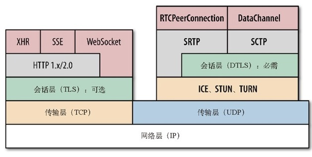

# WEB性能优化


### CDN

Content Delivery Network,内容分发网络

通过把内容部署在全球各地，让用户从最近的服务器加载内容。大幅降低传播分组的时间。


### traceroute

traceroute测量延迟


### 带宽和延迟

延迟影响因素最大

### Ookla测宽带

http://speedtest.net


## TCP

IP：负责联网主机之间的路由选择和寻址
TCP:负责在不可靠的传输信道上提供可靠的抽象层。

HTTP可以用TCP传输协议或者其他，例如UDP协议


### 三次握手

1. 客户端选择一个随机序列号x，并发送一个SYN分组，其中可能还包括其他TCP标志和选项
2. SYN ACK : 服务器给X加1，并选择自己的一个随机序列号y，追加自己的标志和选项，然后返回响应
3. ACK：客户端给x和y加1并发送握手期间的最后一个ACK分组。

### 拥塞预防以及控制

#### 流量控制

rwnd：[接收窗口],发送端和接收端的接收窗口大小，包含能够保存数据的缓冲区空间大小的信息。

窗口缩放: TCP Window Scaling

4种预防流量暴增算法 ：慢启动，拥塞预防，快速重发，快速恢复

#### 慢启动

保守的窗口初始化链接，随后的每次往返都会成倍提高传输的数据量

cwnd：拥塞窗口大小，发送端对从客户端接收确认（ACK）之前可以发送数据量的限制。

指数增加传递cwnd

#### 拥塞预防

### 带宽延迟积

BDP:数据链路的容量与其端到端延迟的乘积。这个结果就是任意时刻处于在途未确认状态的最大数据量。

### 队首阻塞

按序交付和可靠交付的时候，TCP不是必要的选择。会导致额外的延迟，对性能造成负面影响。

无需按序交付数据或能够处理分组丢失的应用程序，以及对延迟或者抖动要求很高的应用程序，最好选择UDP等协议。

### TCP优化

- TCP三次握手增加了整整一次往返时间
- TCP慢启动讲被应用到每个新链接
- TCP流量及拥塞控制会影响所有链接的吞吐量
- TCP的吞吐量由当前拥塞窗口大小控制

#### 服务器配置调优

让服务器跟上时代是优化发送端和接收端的首要措施

优化项：

- 增大TCP的初始拥塞窗口

- 慢启动重启：在连接空闲时，禁用慢启动可以改善瞬时发送数据的长TCP连接的性能。

- 窗口缩放(RFC1332):启用窗口缩放可以增大最大接收窗口大小，可以让高延迟的连接增加吞吐量。

- TCP快速打开：

#### 应用程序行为调优

- 再快也快不过什么也不用发送，能少发就少发

- 我们不能让数据传输的更快，但可以让他们传输的距离更短

- 重用TCP连接是提升性能的关键，

#### 检查清单：

- 把服务器内核升级到最新版本
- 确保cwnd大小为10
- 禁用空闲后的慢启动
- 确保启动窗口缩放
- 减少传输冗余数据
- 压缩要传输的数据
- 把服务器放到离用户近的地方以减少往返时间
- 尽最大可能重用已经建立的TCP连接。

## UDP

## 传输层安全（TLS）

SSL(Secure Sockets Layer,安全套接字层)。

SSL不会影响上层协议（如HTTP，电子邮件，即时通讯），但能够保证上层协议的网络通信安全。

TSL1.0 也就是 SSL3.0 的升级版

1. 应用层（HTTP...）
2. 会话层 (TLS)
3. 传输层(TCP)
4. 网络层(IP)
5. 数据链路层
6. 物理层


### 加密，身份验证，完整性

加密：混淆数据的机制

身份验证：验证身份标识有效性的机制

完整性：检测消息是否被篡改或伪造的机制

### TLS握手

每个TLS连接在TCP握手基础上最多还需要两次额外的往返。

- **公钥与对称密钥加密：**

公钥加密系统只在建立TLS信道的会话中使用。  
在此期间服务器向客户端提供它的公钥，  
客户端生成密钥并使用服务器的公钥对其加密。然后讲加密的对称密钥返回给服务器  
服务器用自己的私钥解密出客户端发来的对称密钥

- HTTP通常是80端口，TLS是443端口

- ALPN(应用层协议协商)：作为TLS的扩展，让我们能在TLS握手的同时协商应用协议，从而省掉了HTTP的Upgrade机制所需的额外往返时间。

- 网络上可以建立TCP连接的任意两端都可以建立加密TLS信道，客户端只需知道另一段的IP地址，即可建立连接并进行TLS握手。

### TLS会话恢复

### 信任链与证书颁发机构

### 证书撤销

### TLS记录协议

与位于其下的IP或TCP层没有什么不同，TLS会话中交换的所有数据同样使用规格明确的协议进行分帧。TLS记录协议负责识别不同的消息类型（握手，警告或数据，通过“内容类型”字段），以及每条消息的安全和完整性验证。

### 针对TLS优化建议

#### 计算成本

SSL/TSL计算只占CPU负载的不到1%。  
以及不到2%的网络资源  
SSL/TSL计算已经不是问题了

- 要把SSL库升级到最新版本，在此基础上再构建Web服务器和代理服务器。最新的OpenSSL在性能方面有了明显的提升。


#### 今早完成(握手)

简言之：把服务器放到接近客户端的地方能够节约TCP和TLS握手的时间！

#### 会话缓存与无状态恢复

SSL2.0引入的会话表示符机制是TLS会话缓存的基础，目前已经得到大多数客户端和浏览器的广泛支持。

#### TLS记录大小

小记录会造成浪费，大记录会导致延迟。

#### TLS压缩

禁用TLS压缩，应该使用服务器的Gzip设置压缩所有文本资源，同时对图像，视频，音频等媒体采用最合适的压缩格式。

#### 证书链的长度

#### OCSP封套

#### HTTP严格传输安全（TSTS）

### TLS性能清单

- 要最大限制提升TCP性能
- 把TLS库升级到最新版本
- 启动并配置会话缓存和无状态恢复
- 监控会话缓存的使用情况并作出相应调整
- 在接近用户的地方完成TLS会话，尽量减少往返延迟
- 配置TLS大小，使其恰好能封装在一个TCP段内
- 确保证书链不会超过拥塞窗口的大小
- 从信任链中去掉不必要的证书，减少链条层次
- 禁用服务器的TLS压缩功能
- 启用服务器对SNI的支持
- 启用服务器的OCSP封套功能
- 追加HTTP严格传输安全首部


## 无线网络

### 类型

- 个人局域网(PAN)

个人活动范围；替代周边设备的线缆；蓝牙，ZigBee，NFC

- 局域网（LAN）

一栋楼或校园内；有线网络的无线扩展；IEEE 802.11（Wi-Fi）

- 城域网（MAN）

一座城市内；无线内联网；IEEE802.15（WiMax）

- 广域网（WAN）

世界范围内；无线网络；蜂窝（UMTS ， LTE等）

### 性能

- 带宽

无线落网是电磁辐射。发送端和接收端必须事先就通信使用的频率范围达成共识。  
影响性能的最主要因素就是频率范围的大小（带宽）。  
在其他条件等同的情况下，频率范围加倍，传输速度加倍。  
低频信号传输距离远，覆盖范围广（大蜂窝），但要求天线更大。高频信号能传输更多数据，但传输距离不远，覆盖范围小，需要较多的基础设施。


- 信号强度

收发两端之间的信号强度，信噪比（SNR，Signal Noise Ratio）；


- 调制

- 影响无线网络性能的因素：

1. 首发端的距离  
1. 当前位置的背景噪声大小  
1. 来自同一网络其他用户的干扰大小  
1. 来自相邻网络其他用户的干扰大小
1. 两端发射功率大小
1. 处理能力及调制算法

如果对性能要求十分苛刻，干脆使用有线

## Wi-Fi


- 网络层次

2.数据链路层：  
802.2逻辑链路控制层（LLC）  
802.2MAC

1.物理层  
802.3以太网  
802.11b Wi-Fi  
802.11g Wi-Fi  
802.11n Wi-Fi  
。。。

- 高负载下性能不稳定的Wi-Fi网络很常见，比如某个技术大会现场，访问同一节点的客户端很多，这时候的Wi-Fi网络很可能就不稳定。当然，概率调度并不是造成这种结果的唯一因素，但无疑是其中之一。


- Wi-Fi网络的广泛部署和流行也导致了最大的一个性能挑战：小区内部和外部干扰。

- 802.11g客户端和路由器的速度可能是54Mbits/s,如果邻居也占用相同Wi-Fi信道，带宽会减至一半；  
新的802.11n和802.11ac标准使用的5GHz频段，拓宽了频率范围，能够保证在多数环境下不发生冲突。

- 运行ping命令可以估计网络第一跳延迟时间

- 关于Wi-Fi性能的重要因素：  
Wi-Fi不保证用户的带宽和延迟时间  
Wi-Fi的信噪比不同，带宽也随之不同  
Wi-Fi的发射功率被限制在200mW以内  
Wi-Fi在2.4GHz和较新的5GHz频段中的频谱有限  
Wi-Fi信道分配决定了接入点信号会重叠  
Wi-Fi接入点与客户端争用同一个无线信道

## 移动网络

### G字号移动网络

- 活动移动连接的数据速率和延迟时间  

代  数据速率  ，   延迟时间  
2G，100-400Kbit/s，300-1000ms  
3G，0.5-5Mbit/s，100-500ms  
4G，1-50Mbit/s，<100ms

## 移动网络的优化建议

## web性能要点


### 时间

时间 ：     感觉

0-100ms：  很快

100-300ms：有一点点慢

300-1000ms：机器在工作呢

>1000ms:先干点别的吧

>10000ms:不能用了

### 请求构成

每个http请求都由很多独立的阶段构成：

DNS解析，TCP链接握手，TLS协商（必要时）发送http请求，下载内容

### 资源瀑布图

### 延迟是性能瓶颈

> 如果延迟对大多数有线链接是限制性能的因素，那可想而知，它对无线客户端将是更重要的性能瓶颈。事实上，无线延迟明显更高，因此网络优化是提升移动web应用性能的关键。

> 增加带宽没有那么重要

### 针对浏览器的优化

- 基于文档的优化：优先获取资源

- 推测性优化：预先解析DNS，预先连接可能的目标


页面结构和交付
- css和JavaScript等重要资源应该尽早在文档中出现

- 应该尽早交付css，从而解除渲染阻塞并让javascript执行

- 非关键性JavaScript应该推迟，以避免阻塞DOM和CSSOM构建

- HTML文档由解析器递增解析，从而保证文档可以间歇性发送，以求得最佳性能。

## HTTP1.1优化

### 《高性能网站建设指南》说的一些优化：

- 减少DNS查询，每次域名解析都需要一次网络往返，增加请求的延迟，在查询期间会阻塞请求。

- 减少HTTP请求

- 使用CDN

- 添加Expires首部并配置ETag标签：相关资源应该缓存，避免重复。Expires首部可于指定缓存时间，在这个时间内可以直接直接从缓存取得资源，完全避免HTTP请求。

- Gzip资源，Gzip可以减少60%-80%的文件大小。

- 避免HTTP重定向，HTTP重定向极其耗时，特别是把客户端定向到一个完全不同的域名的情况下，还会导致额外的DNS查询，TCP连接延迟，等等。

### HTTP管道

> HTTP管道可以让我们把FIFO（先进先出）队列从客户端（请求队列）迁移到服务器（响应队列）；  
主要是消除了发送请求和响应的等待时间，这种并行处理请求的能力对提升性能的帮助非常之大

> 事实上，网络延迟越高，请求越多，节省的时间越多。越是大型应用，网络优化的影响越大。

> 服务器可以并行处理请求。但HTTP1.X只能严格串行地返回响应。HTTP1.X不允许一个连接上的多个响应数据交错到达（多路返回），因而一个响应必须完全返回后，下一个响应才会开始传输。

> 队首阻塞：第一个请求耗时更长，但同时服务器已经处理完第二个或者后续请求。此时，在HTTP1.1中，所有后续的请求都将被阻塞，等待它完成。

实际上，HTTP管道通常作为浏览器的高级配置，大多数会禁用它。比较难通过HTTP管道提升性能。


### 使用多个TCP连接

> 现实中，大多数浏览器，包括桌面和移动浏览器，都支持每个主机打开6个连接。  
此时：  
1.客户端并行分派最多6个请求  
2.服务器并行处理最多6个请求  
3.第一次往返可以发送的累计分组数量（TCP cwnd）增长为原来的6倍。


### 域名区分

> 主机名称不一样了，就可以突破浏览器的连接限制，实现更高的并行能力。域名分区使用得越多，并行能力就越强。

> 把多个域名解析到同一个IP地址是很常见的做法。所有分区都通过CNAME DNS记录指向同一个服务器，而浏览器连接限制针对的是主机名，不是IP地址。另外每个分区也可以指向一个CDN或其他可以访问到的服务器。

### 度量与控制协议开销

> RFC2616(HTTP1.1)没有对HTTP首部的大小规定任何限制。然后，实际中，很多服务器和代理都会将其限制在8KB或16KB之内。

> 所有HTTP首部都以纯文本形式发送（不会经过任何压缩），这就会给每个请求附加较高的额外负荷。

> Cookie在很多应用中都是常见的性能瓶颈。

### 连接与拼合

- 把多个Javascript或CSS文件组合为一个文件；把多个图片组合为一个更大的复合的图片

> 浏览器是以递增方式处理HTML的，而对于Javascript和CSS的解析及执行，则要等到整个文件下载完毕。Javascript和CSS处理器都不允许递增式执行。

> CSS文件越大，浏览器在构建CSSOM前经历的阻塞时间就越长，从而推迟首次绘制页面的时间。类似地，Javascript文件越大，对执行速度的影响同样越大；小文件倒是能实现“递增式”执行。

> 谷歌团队证明30-50KB（压缩后）是每个Javascript文件大小的合适范围。

### 嵌入资源

- 把资源嵌入文档，减少请求。

- Javascript和css通过适当的script和style块可以直接放在页面中。图片甚至音频和PDF文件，都可以通过数据URI（data:[mediatype][:base64],data）的方式嵌入到页面。


> IE最大允许32KB数据URI

- 常见只考虑嵌入1-2KB以下的资源；只使用一次，不需要缓存的资源；


## HTTP2.0

> 更快，更简单，更健壮

> HTTP2.0的目标:   
1.支持请求与响应的多路复用来减少延迟  
2.通过压缩HTTP首部字段将协议开销降至最低。  
3.同时增加对请求优先级和服务器推送的支持

### 技术点

#### 二进制分帧层

- HTTP的语义，包括各种动词，方法，首部都不受影响，不同的是传输期间对他们的编码方式变了。HTTP1.x以换行符作为纯文本的分隔符，而HTTP2.0将所有传输的信息分隔为更小的消息和帧，并对他们采用二进制格式的编码

#### 流 消息 帧

- 流：已建立的连接上的双向字节流

- 消息：与逻辑消息对应的完整的一系列数据帧

- 帧： HTTP2.0通信的最小单位，每个帧包含帧首部，至少也会标识出当前帧所属的流

> 所有HTTP2.0通信都在同一个连接上完成，这个连接可以承载任意数量的双向数据流。相应地，每个数据流以消息的形式发送，而消息由一或多个帧组成，这些帧可以乱序发送，然后再根据每个帧首部的流标识符重新组装。

**几个概念点：**

- 所有的通信都在一个TCP连接上完成
- 流是连接中的一个虚拟信道，可以承载双向的消息；每个流都有一个唯一的整数标示符（1，2，。。。N）；
- 消息是指逻辑上的HTTP消息，比如请求，相应等，由一或多个帧组成
- 帧是最小的通信单位，承载着特定类型的数据，如HTTP首部，负荷，等等。

#### 多向请求与响应

巨大的性能提升：
- 可以并行交错地发送请求，请求之间互不影响
- 可以并行交错地发送响应，响应之间互不影响
- 只使用一个连接即可并行发送多个请求和响应
- 消除不必要的延迟，从而减少页面加载的时间
- 不必再为绕过HTTP1.x限制而多做很多工作

#### 请求优先级

> 每个流都可以带有一个31比特的优先值。0表示最高优先级，2（31）- 1表示最低优先级。

> HTTP2.0没有规定处理优先级的具体算法。策略：客户端应该明确指定优先值，服务器应该根据该值处理和交付数据。

> 服务器可以而且应该交错发送不同优先级别的帧。既避免队首阻塞，又高效利用底层连接。

#### 每个来源一个连接

不仅减少网络延迟，还有助于提高吞吐量和降低运营成本。

#### 流量控制

> 优先级可以决定交付次序，而流量控制则可以控制HTTP2.0连接中每个流占用的资源：接收方可以针对特定的流广播较低的窗口大小，以限制它的传输速度。

HTTP2.0为数据流和连接的流量控制提供了一个简单的机制：
- 流量控制基于每一跳进行，而非端到端的控制
- 流量控制基于窗口更新帧进行，即接收广播自己准备接收某个数据流的多少字节，以及对整个连接要接收多少字节
- 流量控制窗口大小通过WINDOW_UPDATE帧更新，这个字段指定了流ID和窗口大小递增值
- 流量控制有方向性，即接收方可能根据自己的情况为每个流乃至整个连接设置任意窗口的大小。
- 流量控制可以由接收方禁用，包括针对个别的流和针对整个连接

#### 服务器推送

##### 在HTTP2.0中，把资源通过HTTP推送给客户端，有以下好处：
- 客户端可以缓存推送过来的资源
- 客户端可以拒绝推送过来的资源
- 推送资源可以由不同的页面共享
- 服务器可以按照优先级推送资源

> 理论上，除了只有某页面需要的插入资源，之外的所有应用都应该使用HTTP2.0服务器推送。

> 推送资源直接进入客户端，不存在客户端API或Javascript回调方法等通知机制，可以用于确定资源何时到达。

#### 首部压缩

- HTTP2.0在客户端和服务器端使用“首部表”来跟踪和存储之前发送的键-值对，对于相同的数据，不再通过每次请求和响应发送
- 首部表在HTTP2.0的连续存续期内始终存在，由客户端和服务器共同渐进地更新
- 每个新的首部键-值对要么被追加到当前表的末尾，要么替换表中之前的值。

#### 有效的HTTP2.0升级与发现


## 优化交付

> 影响绝大多数Web应用性能的并非带宽，而是延迟。网速越来越快，但延迟似乎并没有缩短

**经典的性能优化最佳实践**

### 1.减少DNS查找：  
每一次主机名解析都需要一次网络往返，从而增加请求的延迟时间，同时还会阻塞后续请求。

### 2.重用TCP连接：  
尽可能使用持久连接，以消除TCP握手和慢启动延迟；

### 3.减少HTTP重定向：
HTTP重定向极费时间，特别是不同域名之间的重定向，更加费时；这里面既有额外的DNS查询，TCP握手，还有其他延迟。最佳的重定向次数为零。

### 4.使用CDN（内容分发网络）：  
把数据放到离用户地理位置更近的地方，可以显著减少每次TCP连接的网络延迟，增大吞吐量

### 5.去掉不必要的资源：  
任何请求都不如没有请求


### 6.在客户端缓存资源：

- 保证首部包含适当的缓存字段：

  Cache-Control：指定缓存时间  
  Last-Modified和Etag首部提供验证机制

- 图片合适的有损压缩

  WebP是谷歌开发的一种新图片格式


### 7.传输压缩过的内容：  
传输资源采用最好的压缩手段

### 8.消除不必要的请求开销： 

减少请求的HTTP首部数据（比如HTTP cookie），节省的时间相当于几次往返的延迟时间。

- HTTP是无状态协议

- RFC2965扩展：允许任何网站针对自身来源关联和更新cookie元数据；浏览器保存数据，而在随后发送给来源的每一个请求的cookie首部中自动附加这些信息。  
浏览器会自动附加关联的cookie数据；  
HTTP1.x下，包括cookie在内的HTTP首部都会在不压缩的状态下传输；

- 大多数浏览器限制cookie大小4KB


### 9.并行处理请求和响应： 


- 使用持久连接，从HTTP1.0升级到1.1
- 利用多个HTTP1.1实现并行下载
- 可能的情况下利用HTTP1.1管道
- 考虑升级到HTTP2.0
- 确保服务器有足够的资源并行处理请求


### 10.针对协议版本采取优化措施：  
HTTP 1.x支持有限的并行机制，要求打包资源，跨域分散资源，等等。相对而言，HTTP2.0只要建立一个连接就能实现最佳性能，同时无需针对HTTP1.x的那些优化方法。


## XMLHttpRequest

> XHR是浏览器层面的API

> XHR之前，网页要获取状态更新，必须刷新一次。XHR之后，实现异步实现，是网页交互应用的根本技术

> XHR并不是针对XML开发的

### 跨源资源共享（CORS）

> XHR允许设置自定义HTTP首部，但有些首部是应用代码不能设定的：  
Accept-Charset, Accept-Encoding,Access-Control-*  
Host, Upgrade, Connection, Reffer, Origin  
Cookie, Sec-*, Proxy-*以及其他很多首部

#### 浏览器处理跨源


XHRAPI调用相同，不过浏览器会处理请求

请求：  
GET /resource.js HTTP/1.1  
Host: third.com  
Origin: http://example.com
...

响应：  
HTTP/1.1 200 OK
Access-Control-Allow-Origin：http://example.com
...

third.com  同意 example.com的请求，就会返回Access-Control-Allow-Origin，否则不返回对应信息。

Access-Control-Allow-Origin：* 允许来自任何源的请求。


#### CORS的一系列安全措施

- CORS请求会省略cookie和HTTP认证等用户凭据：  

要启用cookie和HTTP认证，客户端需要XHR请求时额外发送withCredentials属性。同时，服务器以适当的首部（Access-Control-Allow-Credentials）响应。


- 客户端被限制只能发送“简单的跨源请求”，包括只能使用特定的方法（GET POST HEAD）。只能访问可以通过XHR发送并读取的HTTP首部

如果客户端需要写或者读自定义的HTTP首部，想要使用“不简单的方式”发送请求，那么它必须首先要获得第三方服务器的许可，发送一个preflight请求（options）

```
//preflight请求
OPTIONS /resource.js HTTP1.1
Host: third.com
Origin: http://example.com
Access-Control-Request-Method: POST
Access-Control-Request-Headers: My-Customer-Header

//响应
//HTTP1.1 200 OK
Access-Control-Allow-Origin: http://example.com
Access-Control-Allow-Methods: GET,POST,PUT
Access-Control-Allow-Headers: My-Customer-Header

//正式的CORS请求
```

### XHR下载数据

> XHR可以传输文本数据，二进制数据

> 浏览器自动编码，解码很多原生数据类型:  
ArrayBuffer: 固定长度的二进制数据缓冲区  
Blob：二进制大对象或者不可变数据  
Document：解析后得到的HTML或XML文档  
JSONJSON：表示简单数据结构的Javascript对象  
Text：简单的文本字符串

> Blob是HTML5的file API

### XHR上传数据

> XHR send()方法可以接受DOMString，Document，FormData，Blob，File 以及ArrayBuffer对象


```js
//简单文本上传到服务器
var xhr = new XMLHttpRequest();
xhr.open('POST','./upload');
xhr.onload = function(){
  ...
}
xhr.send('text string');

//FormData API动态创建表单数据，上传multipart/form-data对象
var formData = new FormData();
formData.append('id',2);
formData.append('str','dwqewqeq');

var xhr = new XMLHttpRequest();
xhr.open('POST','./upload');
xhr.onload = function(){}
xhr.send(formData);

//上传8字节整型的有类型数组
var xhr = new XMLHttpRequest();
xhr.open('POST','./upload');
xhr.onload = function(){};
var uInt8Array = new Uint8Array([1,2,3]);
xhr.send(uInt8Array.buffer);


//上传二进制Blob或用户提交的文件
var blob = ...;
const BYTE_PER_CHUNK = 1024*1024;
const SIZE = blob.size;

var start = 0;
var end = BYTE_PER_CHUNK;

while(start < SIZE) {
  var xhr = new XMLHttpRequest();
  xhr.open('POST','/upload');
  xhr.onload = function(){}
  xhr.setRequestHeader('Content-Range',start+'-'+end+'/'+SIZE);
  xhr.send(blob.splice(start,end));
  start = end;
  end = start + BYTE_PER_CHUNK;
}


```

### 上传下载进度

> 要估算传输完成的数据量，服务器必须在响应中提供内容长度（Content-Length）首部，对于分块数据，由于响应的总长度未知，因此就无法估计进度了。

> XHR默认没有超时限制

```js
var xhr = new XMLHttpRequest();
xhr.open('GET','./resource');
xhr.timeout = 5000;

xhr.addEventListener('load',function(){
});
xhr.addEventListener('error',function(){
});
var onProgressHandler = function(event){
  if(event.lengthComputable){
    var progress = (event.loaded / event.total) * 100;
  }
}
//上传注册进度
xhr.upload.addEventListener('progress',onProgressHandler);
//下载注册进度
xhr.addEventListener('progress',onProgressHandler);
xhr.send();
```

### 实时通知 交付

#### 轮询

```js
setInterval("xhrFn,60000");
```
定时发送XHR

#### 长轮询

```js
function checkUpdates(url){
  var xhr = new XMLHttpRequest();
  xhr.open('GET',url);
  xhr.onload = function(){
    ...
    checkUpdates('/update');
  }
  xhr.send();
}
checkUpdates(('/update');
```

### XHR场景

> 局限性：  
从未考虑流式数据处理，支持有限  
没有好的方式实时交付更新


## 服务器发送事件（SSE）

> Server-Sent Event(SSE)：让服务器可以向客户端流式发送文本消息。

> SSE的两个组件：  
1.浏览器中的EventSource  
2.新的“事件流”数据格式

> SSE的特点：  
通过一个长连接低延迟交付  
高效的浏览器消息解析，不会出现无限缓冲  
自动跟踪最后看到的消息及自动重新连接  
消息通知在客户端以DOM事件形式呈现

### EventSource API

```js
var source = new EventSource("/path/to/stream-url");
source.onopen = function(){
  //...
}
source.onerror = function(){
  //...
}
//监听foo事件 使用自定义代码
source.addEventListener("foo", function(event){
  processFoo(event.data);
})

source.onmessage = function(event){
  log_message(event.id,event.data);
  if(event.id == "CLOSE") {
    source.close();
  }
}
```

> 目前大多数浏览器支持，IE和Opera Mini不支持

> 有腻子脚本可以在XHR基础上实现在不支持的浏览器使用EventSource。有库可以选择。比如jQuery.EventSource使用XHR轮询模拟SSE

### Event Stream 协议

SSE事件流是以流式HTTP响应形式交付的。  
客户端发起常规HTTP请求，服务器以自定义的“text/event-stream”内容类型响应，然后交付UTF-8编码的事件数据。

```
//请求
GET /stream HTTP/1,1
Host: example.com
Accept: text/event-stream

//响应
HTTP/1.1 200 OK
Connection: keep-alive
Connection-type: text/event-stream
Transfer-Encoding: chunked
//中断后重新连接的时间
retry: 15000
//不带消息类型的简单文本
data: First message is a simple string
//不带消息类型的JSON数据
data:{"message":"23131"}
//类型为foo的简单文本
event: foo
data: Message of type foo
//带消息类型和ID的多行文本
id: 42
event: bar
data: Multi-line message of 
data: type "bar" and id "42"

id:43
data:Last message, id "43"

```

> SSE连接是UTF-8编码，本质上是HTTP流式响应，是可以压缩的

### SSE使用场景以及性能

> 两个局限：  
1.只能从服务器向客户端发送数据，不能满足需要请求流的场景（比如向服务器流式上传大文件）  
2.事件流协议设计为只能传输UTF-8数据，即使可以传输二进制流，效率也不高


## WebSocket

> WS是浏览器中最灵活的一个传输机制，其简单API可以让我们在客户端和服务器之间以数据流的形式实现各种应用数据交互（包括JSON及自定义的二进制消息格式），而且两端都可以随时向另一端发送数据

### WebSocket API

```js
var ws = new WebSocket('wss://example.com/socket');

ws.onerror = function(error){

}
ws.onclose = function(error){

}
ws.onopen = function(){
  ws.send("connection established .hello server");
}
ws.onmessage = function(msg){
  if(msg.data instanceof Blob){
    processBlob(msg.data);
  } else {
    processText(msg.data);
  }
} 
```

> WS也可以用Javascript库来模拟

> 使用库时，如Socket.IO时，要留心其底层实现，以及客户端和服务器的配置，保证尽可能利用原生WS接口以求最佳性能。确保传输机制满足性能要求。

- WS与WSS

ws表示纯文本信息  
wss表示使用加密信道通信（TCP + TLS）  
WebSocket的连接协议也可以用于浏览器之外的场景，可以通过非HTTP协商机制交换数据。

- 接收文本和二进制数据

浏览器接收到新消息后，如果是文本数据，会自动将其转换成DOMString对象，如果是二进制数据或Blob对象，会直接将其转交给应用。

> send方法是异步的，提供的数据会在客户端排队，而函数则立即返回。不要误认为返回快，数据就发出去了

- 子协议协商

> 客户端可以在初次连接握手时，告诉服务器自己支持哪种协议。

```js
var ws = new WebSocket(
  'wss://example.com/socket',
  [
    'appProtocol',
    'appProtocol-v2'
  ]
);
```

### WebSocket 协议

> WebSocket 协议是一个独立完善的协议，可以在浏览器外实现。不过它的主要应用目标还是实现浏览器应用的双向通信。

#### 二进制分帧层

> 每一帧的第一位（FIN）表示当前帧是不是消息的最后一帧。

> WS很容易发生队首阻塞的情况:消息可能会被分成一个或多个帧，但不同消息的帧不能交错发送

> WS不支持多路复用，还意味着每个WS都需要一个专门的TCP连接。

#### 协议扩展

其中两项扩展：

- 多路复用扩展：

将websocket的逻辑连接独立出来，实现共享底层的TCP连接

- 压缩扩展：

给Websocket协议增加了压缩功能

#### HTTP升级协商

> 利用HTTP完成握手有几个好处。让WS与现有的HTTP基础设施兼容，WS服务器可以运行在80（HTTP）和443（HTTPS）端口上。

### WebSocket使用场景 性能

#### 请求和响应流

- XHR:

专门为“事务型”请求/响应通信而优化，客户端向服务端发送完整的，格式良好的HTTP请求，服务器返回完整的响应。这里不支持请求流，在Stream API可用之前，没有可靠的跨浏览器响应流API

- SSE

实现服务器到客户端的高效，低延迟的文本数据流：客户端发起SSE连接，服务器使用事件源协议将更新流发送给客户端。客户端在初次握手后，不能向服务器发送任何数据。

#### 消息开销

#### 数据效率及压缩

#### 自定义应用协议

## WebRTC

> Web Real-Time Communication (Web实时通信，WebRTC)由一组标准，协议和Javascript API组成，用于实现浏览器之间（端到端）的音频，视频及数据共享。

> 浏览器关于音频视频等高品质应用对应的API：  
MediaStream 获取音频和视频流  
RTCPeerConnection 音频和视频数据通信  
RTCDataChannel 任意应用数据通信

> WebRTC通过UDP传输数据，不过UDP只是个起点。

### 标准和WebRTC发展

- W3C的Web Real-Time Communications（WEBRTC）Working Group 负责制定浏览器API

- IETF的Real-Time Communication in Web-browsers（RTCWEB）定义协议，数据格式，安全及其他在浏览器中实现端到端通信必需的内容

### 音频和视频引擎

- W3C的Media Capture and Streams规范规定了一套新的Javascript API，应用可以通过这套API从平台取得音频和视频流，并对他们进行操作处理。MediaStream是该功能主要接口。

- getUserMedia() API：  
负责获准访问用户的麦克风和摄像机。并获取符合指定要求的流。是从底层平台取得视频和音频流的简单API。得到的媒体都经过WebRTC音频和视频引擎的自动优化，编码，解码，然后就可以输出到各种目的地。

- 取得流后，可以将它们提供给其他浏览器API：  
通过Web Audio API在浏览器中处理音频  
通过Canvas API 采集个别视频帧并加以处理  
通过CSS3和WebGL API为输出的流应用各种2D/3D特效。


- 音频（Opus） 视频（VP8）比特率：  
WebRTC实现使用Opus和VP8编解码器。单方高清音视频流最多需要2.5Mbit/s以上的带宽。如果是多方视频通话，考虑到要额外占用带宽，CPU和GPU及内存资源，就必须降低品质

### 实时网络传输

- 因为及时性的要求高于可靠性。所以UDP协议才更适合用于传输实时数据。TCP适合传输可靠的，有序的数据流。

- 相对TCP，UDP的特点：  
不保证消息交付：不确认，不重传，无超时  
不保证交付顺序：不设置包序号，不重排，不会发生队首阻塞  
不跟踪链接状态：不必建立连接或重启状态机  
不需要拥塞控制：不内置客户端或网络反馈机制


- WebRTC的协议分层




### RTCPeerConnection API简介

- RTCPeerConnection 管理穿越NAT的完整ICE工作流
- 发送自动（STUN）持久化信号
- 跟踪本地流
- 跟踪远程流
- 按需触发自动流协商
- 提供必要的API，以生成连接提议，接收应答，允许我们查询连接的当前状态，等等，


### DataChannel


### 建立端到端的连接


